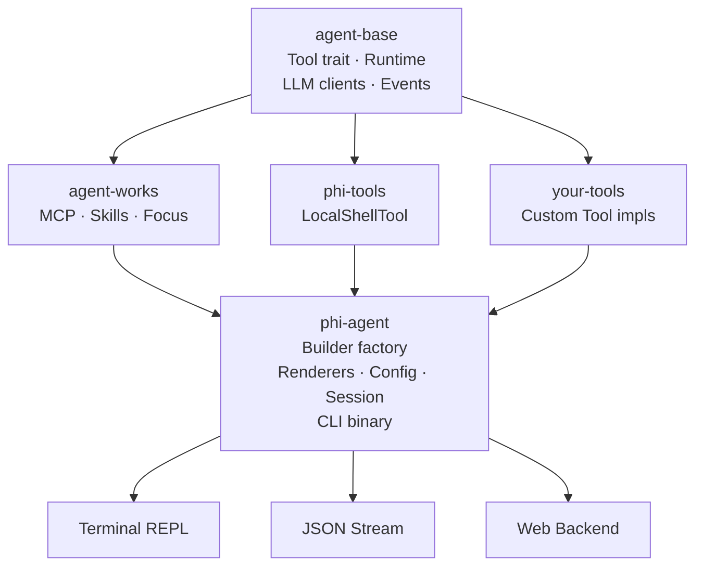

# <picture><source media="(prefers-color-scheme: dark)" srcset="assets/logo.svg"></picture>

[](https://github.com/hibuka-labs/phi-agent/actions)
[](https://crates.io/crates/phi-agent)
[](https://docs.rs/phi-agent)
[](https://codecov.io/gh/hibuka-labs/phi-agent)
[](https://opensource.org/licenses/MIT)
[](https://docs.phi-agent.dev)
[](https://pypi.org/project/phi-agent/)

Not another AI Agent, but an open application framework for building Agents — purpose-built for embedded, edge, and vertical industries, equally suited for highly customizable, high-performance cloud and desktop AI applications. Simple, pure, predictable.

> **Unlike LangChain, CrewAI, or AutoGen, phi-agent ships with zero built-in tools.** No pre-packaged toolkits, no hidden prompt engineering, no magic workflow engine — just a clean Rust runtime. You define every tool, you control every behavior.

Built on [agent-base](https://crates.io/crates/agent-base) and [agent-works](https://crates.io/crates/agent-works). **phi-agent provides the infrastructure. You bring the tools.**

## Ecosystem

phi-agent is part of a family of independent crates:

| Crate | crates.io | Description |
|-------|-----------|-------------|
| `agent-base` | [](https://crates.io/crates/agent-base) | Lightweight runtime kernel — LLM clients, Tool trait, event stream |
| `agent-works` | [](https://crates.io/crates/agent-works) | Batteries-included toolbox — MCP, Skills, Focus |
| `phi-agent` | [](https://crates.io/crates/phi-agent) | Full framework — builder factory, renderers, config, CLI binary |

**Just need the runtime?** `cargo add agent-base`. **Need the full framework?** `cargo add phi-agent`.

## SDKs

Prefer Python? phi-agent supports multiple languages — write tools in your favorite language, powered by the same Rust runtime.

| Language | Package | Version |
|----------|---------|---------|
| Python | `pip install phi-agent` | [](https://pypi.org/project/phi-agent/) |

### Python

```bash
pip install phi-agent
```

```python
from phi_agent import Agent, tool

@tool
async def search(query: str) -> str:
    """Search the web."""
    return f"Results for: {query}"

agent = Agent(model="gpt-4o")
agent.register(search)

async for event in agent.run("What's new today?"):
    print(event)
```

The Python SDK communicates with the `phi` Rust binary over stdio — you write tools in Python, and the Rust runtime handles the agent loop, LLM calls, and event streaming.

📖 [Python SDK docs →](https://pypi.org/project/phi-agent/)

## Architecture



**Core principle**: phi-agent ships with **zero** built-in tools. You define them, you register them. phi-agent discovers and manages them at runtime — listing, logging, and routing tool calls automatically.

## Why phi-agent

**Built for Vertical Scenarios.** Not a generic chatbot, but an Agent framework for embedded systems, industrial, IoT, and other vertical domains, as well as desktop and cloud applications that demand deep customization — your scenario, your tools, your full control.

**Lightweight, Runs Anywhere.** A single Rust binary with zero runtime dependencies — from embedded Linux and edge gateways to cloud containers and desktop applications, `cargo install` gets you started in seconds, deploy anywhere.

**Zero Built-in Tools, Fully Customizable.** No pre-packaged tools, no platform lock-in — a tool is just 3 methods: `name()`, `definition()`, `call()`, you register what you need, the Agent uses what you register, only bring what your scenario truly needs, LLM freedom, precise and clean.

**Fully Observable, Every Step Explainable.** Every decision is logged, every step is traceable, with built-in session logging, structured tracing, and session metrics at a glance — compliance and audit trails without the stress.

## Features

- **Builder factory** — `base_agent_builder()` with sensible defaults (thinking, recovery, limits)
- **Three renderers** — Terminal (rich, colored, streaming), JSON stream (JSONL), Null (silent)
- **CLI-ready** — REPL and one-shot modes with 20+ configurable flags
- **Session management** — auto-cleanup, file locking, JSONL turn logging
- **Tool-agnostic** — no built-in tools; register your own via `AgentBuilder`
- **Extensible** — middleware, approval handlers, custom renderers

## Quick Start

```rust
use phi_agent::{
    base_agent_builder, build_system_prompt, PhiAgent, PhiAgentConfig,
    OpenAiClient, SafetyConfig, ReasoningEffort,
};
use std::sync::Arc;

#[tokio::main]
async fn main() -> anyhow::Result<()> {
    // 1. Create LLM client
    let llm_client = Arc::new(OpenAiClient::new(
        std::env::var("LLM_API_KEY")?,
        "opus".into(),
        Some("https://api.openai.com/v1".into()),
    ));

    // 2. Build agent (register your tools here)
    let builder = base_agent_builder(llm_client)
        .system_prompt(build_system_prompt())
        .register_tool(your_tool);

    let agent = PhiAgent::build(builder, PhiAgentConfig {
        model: "opus".into(),
        enable_thinking: true,
        thinking_budget: None,
        thinking_effort: ReasoningEffort::Medium,
        safety: SafetyConfig::default(),
    })?;

    // 3. Run
    let session = agent.create_session().await;
    let renderer = phi_agent::create_stdout_renderer(
        &phi_agent::OutputFormat::Terminal {
            show_thinking: true,
            show_tool_args: true,
            color: true,
        }
    );

    agent.run_turn(session, "Hello!", |event| {
        renderer.render(event)
    }).await?;

    Ok(())
}
```

See [examples/](examples/) for more complete examples.

## CLI

```bash
cargo install phi-agent
phi "What's in this directory?"
```

```bash
# REPL mode
phi

# JSON output for scripting
phi --format json "list files"
```

## Custom Tool Example

```rust
use agent_base::{Tool, ToolContext, ToolOutput, ToolControlFlow, AgentResult};
use serde_json::{Value, json};
use async_trait::async_trait;

struct HelloTool;

#[async_trait]
impl Tool for HelloTool {
    fn name(&self) -> &'static str { "hello" }

    fn definition(&self) -> Value {
        json!({
            "name": "hello",
            "description": "Say hello to someone",
            "parameters": {
                "type": "object",
                "properties": {
                    "name": { "type": "string", "description": "Who to greet" }
                },
                "required": ["name"]
            }
        })
    }

    async fn call(&self, args: &Value, _ctx: &ToolContext) -> AgentResult<ToolOutput> {
        let name = args["name"].as_str().unwrap_or("world");
        Ok(ToolOutput { summary: format!("Hello, {}!", name), control_flow: ToolControlFlow::Continue, raw: None, truncation: None })
    }
}
```

Full guide: [guide/custom-tool.md](guide/custom-tool.md)

## Documentation

📖 **Full documentation**: [docs.phi-agent.dev](https://docs.phi-agent.dev)

| Document | Description |
|----------|-------------|
| [Getting Started](guide/getting-started.md) | 5-minute quick start |
| [Custom Tools](guide/custom-tool.md) | How to write a Tool |
| [CLI Usage](guide/cli.md) | CLI flags, REPL, one-shot |
| [Configuration](guide/configuration.md) | Config reference |
| [Focus](guide/focus.md) | Structured single-purpose LLM calls |
| [Architecture](guide/architecture.md) | Design decisions and internals |
| [Observability](guide/observability.md) | Logging, tracing, metrics |
| [Advanced](guide/advanced.md) | Middleware, sessions, event log |

## FAQ

**Q: What's the difference between phi-agent and agent-base?**

agent-base is the runtime kernel (LLM calls, tool orchestration, event stream). phi-agent wraps it with a builder factory, renderers, config resolution, and session management — plus a CLI binary.

**Q: Can I use phi-agent without the CLI?**

Yes. Import it as a library (`phi_agent`) and use `PhiAgent::build()` programmatically. The CLI is just one consumer.

**Q: How do I add my own tools?**

Implement the `Tool` trait from `agent-base` and register with `builder.register_tool(...)`. phi-agent has zero knowledge of what tools exist.

**Q: Does phi-agent support Anthropic / other providers?**

Yes. agent-base provides `AnthropicClient` and `OpenAiClient`. Any client implementing `LlmClient` works.

## Contributing

```bash
git clone git@github.com:hibuka-labs/phi-agent.git
cd phi-agent
cargo check
```

See [CONTRIBUTING.md](CONTRIBUTING.md) for detailed setup instructions and PR guidelines.

## Contributors

Thanks goes to these wonderful people:

<!-- ALL-CONTRIBUTORS-LIST:START - Do not remove or modify this section -->
<!-- prettier-ignore-start -->
<!-- markdownlint-disable -->
<table>
  <tr>
    <td align="center"><a href="https://github.com/shard872"><br /><sub><b>shard872</b></sub></a><br /><a href="https://github.com/hibuka-labs/phi-agent/pull/7" title="Code">💻</a></td>
    <td align="center"><a href="https://github.com/Krshs90"><br /><sub><b>Krish Shah</b></sub></a><br /><a href="https://github.com/hibuka-labs/phi-agent/pull/8" title="Code">💻</a></td>
  </tr>
</table>
<!-- ALL-CONTRIBUTORS-LIST:END -->

([emoji key](https://allcontributors.org/docs/en/emoji-key)) — This project follows the [all-contributors](https://github.com/all-contributors/all-contributors) specification.

## License

MIT — see [LICENSE](LICENSE) for details.

## Contact

:material-email-outline: [phiagent@hibuka.com](mailto:phiagent@hibuka.com)

[中文文档](README_CN.md)
