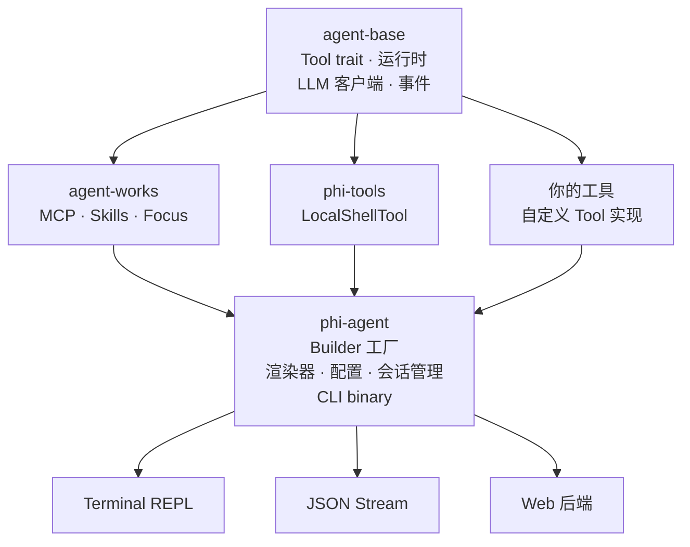

# <picture><source media="(prefers-color-scheme: dark)" srcset="assets/logo.svg"></picture>

[](https://github.com/hibuka-labs/phi-agent/actions)
[](https://crates.io/crates/phi-agent)
[](https://docs.rs/phi-agent)
[](https://codecov.io/gh/hibuka-labs/phi-agent)
[](https://opensource.org/licenses/MIT)
[](https://docs.phi-agent.dev)
[](https://pypi.org/project/phi-agent/)

不是又一个 AI Agent，而是构建 Agent 应用的开放基座 — 专为嵌入式、边缘及垂直行业打造，同样适合高定制、高性能的云端和桌面 AI 应用，简单、纯粹、可控。

> **与 LangChain、CrewAI、AutoGen 不同，phi-agent 不内置任何工具。** 没有预设的工具集，没有隐藏的 prompt 工程，没有黑盒的 workflow 引擎 — 只是一个干净的 Rust 运行时。每个工具由你定义，所有行为由你掌控。

基于 [agent-base](https://crates.io/crates/agent-base) 和 [agent-works](https://crates.io/crates/agent-works) 构建。**phi-agent 提供基础设施，工具由你来定义。**

## 生态

phi-agent 是一组独立 crate 的成员：

| Crate | crates.io | 说明 |
|-------|-----------|------|
| `agent-base` | [](https://crates.io/crates/agent-base) | 轻量运行时内核 — LLM 客户端、Tool trait、事件流 |
| `agent-works` | [](https://crates.io/crates/agent-works) | 功能工具箱 — MCP、Skills、Focus |
| `phi-agent` | [](https://crates.io/crates/phi-agent) | 完整框架 — builder 工厂、渲染器、配置、CLI 二进制 |

**只需要运行时？** `cargo add agent-base`。**需要完整框架？** `cargo add phi-agent`。

## SDK

更喜欢 Python？phi-agent 支持多语言 — 用你喜欢的语言编写工具，同一套 Rust 运行时驱动。

| 语言 | 安装 | 版本 |
|------|------|------|
| Python | `pip install phi-agent` | [](https://pypi.org/project/phi-agent/) |

### Python

```bash
pip install phi-agent
```

```python
from phi_agent import Agent, tool

@tool
async def search(query: str) -> str:
    """搜索网页。"""
    return f"搜索结果: {query}"

agent = Agent(model="gpt-4o")
agent.register(search)

async for event in agent.run("今天有什么新闻?"):
    print(event)
```

Python SDK 通过 stdio 与 `phi` Rust 二进制通信 — 你用 Python 写工具，Rust 运行时负责 Agent 循环、LLM 调用和事件流。

📖 [Python SDK 文档 →](https://pypi.org/project/phi-agent/)

## 架构



**核心理念**：phi-agent **不内置**任何工具。工具由你定义、由你注册，phi-agent 在运行时自动发现、管理和调度——工具列表可查、调用可追踪。

## 为什么选择 phi-agent

**为垂直场景而生。** 不是通用 chatbot，而是面向嵌入式、工业、IoT 等垂直领域，以及桌面、云端等高定制场景的 Agent 构建框架 — 你的场景，你定义工具，你掌控行为。

**极致轻量，哪里都能跑。** Rust 单二进制，无运行时依赖，从嵌入式 Linux、边缘网关到云端容器、桌面应用，`cargo install` 即用，随地部署。

**零内置，全定制。** 不预设任何工具，不绑定任何平台，一个工具只需 3 个方法 — `name()`、`definition()`、`call()`，你注册什么，Agent 就用什么，只带你的场景真正需要的东西，LLM 自由，精准、干净、可控。

**全程可观测，每一步可解释。** 每次决策有记录，每个步骤可追踪，内置会话日志与结构化追踪，会话指标一目了然，垂直场景合规审计无压力。

## 特性

- **Builder 工厂** — `base_agent_builder()` 提供合理默认值（thinking、recovery、limits）
- **三种渲染器** — Terminal（彩色、流式）、JSON stream（JSONL）、Null（静默）
- **CLI 开箱即用** — REPL 和 one-shot 模式，20+ 可配置参数
- **会话管理** — 自动清理、文件锁、JSONL 对话日志
- **工具无关** — 不内置任何工具，通过 `AgentBuilder` 注册你自己的
- **可扩展** — 中间件、审批处理器、自定义渲染器

## 快速开始

```rust
use phi_agent::{
    base_agent_builder, build_system_prompt, PhiAgent, PhiAgentConfig,
    OpenAiClient, SafetyConfig, ReasoningEffort,
};
use std::sync::Arc;

#[tokio::main]
async fn main() -> anyhow::Result<()> {
    // 1. 创建 LLM 客户端
    let llm_client = Arc::new(OpenAiClient::new(
        std::env::var("LLM_API_KEY")?,
        "opus".into(),
        Some("https://api.openai.com/v1".into()),
    ));

    // 2. 构建 Agent（在这里注册你的工具）
    let builder = base_agent_builder(llm_client)
        .system_prompt(build_system_prompt())
        .register_tool(your_tool);

    let agent = PhiAgent::build(builder, PhiAgentConfig {
        model: "opus".into(),
        enable_thinking: true,
        thinking_budget: None,
        thinking_effort: ReasoningEffort::Medium,
        safety: SafetyConfig::default(),
    })?;

    // 3. 运行
    let session = agent.create_session().await;
    let renderer = phi_agent::create_stdout_renderer(
        &phi_agent::OutputFormat::Terminal {
            show_thinking: true,
            show_tool_args: true,
            color: true,
        }
    );

    agent.run_turn(session, "你好！", |event| {
        renderer.render(event)
    }).await?;

    Ok(())
}
```

更多示例参见 [examples/](examples/)。

## CLI

```bash
cargo install phi-agent
phi "这个目录下有什么文件？"
```

```bash
# REPL 模式
phi

# JSON 输出（方便脚本处理）
phi --format json "列出文件"
```

## 自定义工具示例

```rust
use agent_base::{Tool, ToolContext, ToolOutput, ToolControlFlow, AgentResult};
use serde_json::{Value, json};
use async_trait::async_trait;

struct HelloTool;

#[async_trait]
impl Tool for HelloTool {
    fn name(&self) -> &'static str { "hello" }

    fn definition(&self) -> Value {
        json!({
            "name": "hello",
            "description": "对某人打招呼",
            "parameters": {
                "type": "object",
                "properties": {
                    "name": { "type": "string", "description": "要打招呼的对象" }
                },
                "required": ["name"]
            }
        })
    }

    async fn call(&self, args: &Value, _ctx: &ToolContext) -> AgentResult<ToolOutput> {
        let name = args["name"].as_str().unwrap_or("世界");
        Ok(ToolOutput {
            summary: format!("你好，{}！", name),
            control_flow: ToolControlFlow::Continue,
            raw: None,
            truncation: None,
        })
    }
}
```

完整教程：[guide/custom-tool_CN.md](guide/custom-tool_CN.md)

## 文档

📖 **完整文档站**: [docs.phi-agent.dev](https://docs.phi-agent.dev)

| 文档 | 说明 |
|------|------|
| [快速开始](guide/getting-started_CN.md) | 5 分钟上手 |
| [自定义工具](guide/custom-tool_CN.md) | 如何编写 Tool |
| [CLI 使用](guide/cli_CN.md) | CLI 参数、REPL、one-shot |
| [配置详解](guide/configuration_CN.md) | 配置参考 |
| [Focus 专注判断](guide/focus_CN.md) | 结构化单任务 LLM 调用 |
| [架构设计](guide/architecture_CN.md) | 设计决策与内部原理 |
| [可观测性](guide/observability_CN.md) | 日志、追踪、指标 |
| [高级用法](guide/advanced_CN.md) | 中间件、会话、事件日志 |

## 常见问题

**Q: phi-agent 和 agent-base 有什么区别？**

agent-base 是运行时内核（LLM 调用、工具编排、事件流）。phi-agent 在其上封装了 builder 工厂、渲染器、配置解析和会话管理，并提供 CLI 二进制文件。

**Q: 可以不用 CLI，只用库吗？**

可以。引入 `phi_agent` 作为依赖，通过 `PhiAgent::build()` 编程式使用。CLI 只是其中一个消费方。

**Q: 怎么添加自己的工具？**

实现 `agent-base` 中的 `Tool` trait，然后通过 `builder.register_tool(...)` 注册。phi-agent 本身对工具有哪些一无所知。

**Q: 支持 Anthropic / 其他模型提供商吗？**

支持。agent-base 提供了 `AnthropicClient` 和 `OpenAiClient`。任何实现了 `LlmClient` 的客户端都能使用。

## 参与贡献

参见 [CONTRIBUTING.md](CONTRIBUTING.md) 了解开发环境搭建和 PR 流程。

## 贡献者

感谢所有为这个项目做出贡献的人：

<!-- ALL-CONTRIBUTORS-LIST:START - Do not remove or modify this section -->
<!-- prettier-ignore-start -->
<!-- markdownlint-disable -->
<!-- ALL-CONTRIBUTORS-LIST:END -->

([emoji key](https://allcontributors.org/docs/en/emoji-key)) — 本项目遵循 [all-contributors](https://github.com/all-contributors/all-contributors) 规范。

## 许可证

MIT — 详见 [LICENSE](LICENSE)。

## 联系

:material-email-outline: [phiagent@hibuka.com](mailto:phiagent@hibuka.com)

[English](README.md)
