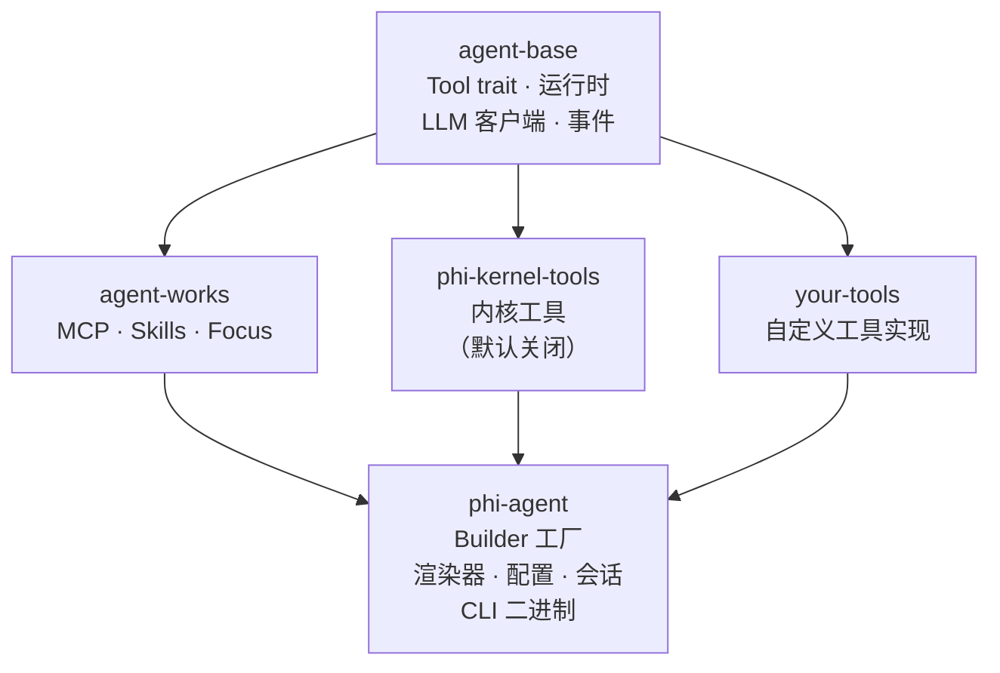

# <picture><source media="(prefers-color-scheme: dark)" srcset="assets/logo.svg"></picture>

[](https://github.com/hibuka-labs/phi-agent/actions)
[](https://crates.io/crates/phi-agent)
[](https://docs.rs/phi-agent)
[](https://codecov.io/gh/hibuka-labs/phi-agent)
[](https://opensource.org/licenses/MIT)
[](https://docs.phiagent.dev)
[](https://pypi.org/project/phi-agent/)

Rust AI Agent 框架。Agent 的调度、会话、流式输出——框架搞定。你只写三样东西：你的工具、你的提示词、你的领域知识。

> **phi-agent 不内置任何业务工具。** 没有搜索引擎、没有数据库连接、没有代码执行器——干干净净的 Rust 运行时。Agent 需要什么工具，完全由你决定。内核原语（文件读写、Shell、子 Agent）通过 `phi-kernel-tools` 按需开启，全部 feature gate 控制，默认关闭。

基于 [agent-base](https://crates.io/crates/agent-base) 和 [agent-works](https://crates.io/crates/agent-works) 构建。**phi-agent 提供基础设施，你提供工具。**

## 生态

| Crate | crates.io | 说明 |
|-------|-----------|------|
| `agent-base` | [](https://crates.io/crates/agent-base) | 轻量运行时内核——LLM 客户端、Tool trait、事件流 |
| `agent-works` | [](https://crates.io/crates/agent-works) | 开箱即用工具箱——MCP、Skills、Focus |
| `phi-agent` | [](https://crates.io/crates/phi-agent) | 完整框架——Builder 工厂、渲染器、配置、CLI 二进制 |

**只需要运行时？** `cargo add agent-base`。**需要完整框架？** `cargo add phi-agent`。

## 架构



### 内核工具

全部通过 feature flag 按需开启：

| Feature | 能力 | 默认 |
|---------|------|------|
| `file` | 文件读写、列表 | 关闭 |
| `shell` | 执行 Shell 命令 | 关闭 |
| `multi-agent` | 启动子 Agent | 关闭 |

## 为什么选择 phi-agent

**你的领域，你做主。** Agent 调度循环、会话管理、流式事件、工具路由、审批拦截——框架全做了。你不用写胶水代码，专注领域逻辑。

**单一二进制，零依赖。** 不需要 Node.js。不需要 Python。编译出来就一个文件，丢过去就跑。`cargo install`，十秒起步。

**每一步可审计。** 每一次 LLM 调用、每一次工具执行，JSONL 全记录。会话可快照、行为可追踪，问题可定位。

## 快速开始

```rust
use phi_agent::{
    base_agent_builder, build_system_prompt, PhiAgent, PhiAgentConfig,
    OpenAiClient, SafetyConfig, ReasoningEffort,
};
use std::sync::Arc;

#[tokio::main]
async fn main() -> anyhow::Result<()> {
    let llm_client = Arc::new(OpenAiClient::new(
        std::env::var("LLM_API_KEY")?,
        "gpt-4o".into(),
        Some("https://api.openai.com/v1".into()),
    ));

    let builder = base_agent_builder(llm_client)
        .system_prompt(build_system_prompt())
        .register_tool(your_tool);

    let agent = PhiAgent::build(builder, PhiAgentConfig {
        model: "gpt-4o".into(),
        enable_thinking: true,
        thinking_budget: None,
        thinking_effort: ReasoningEffort::Medium,
        safety: SafetyConfig::default(),
    })?;

    let session = agent.create_session().await;
    let renderer = phi_agent::create_stdout_renderer(
        &phi_agent::OutputFormat::Terminal {
            show_thinking: true,
            show_tool_args: true,
            color: true,
        }
    );

    agent.run_turn(session, "Hello!", |event| {
        renderer.render(event)
    }).await?;

    Ok(())
}
```

更多示例见 [examples/](examples/)。

## CLI

```bash
cargo install phi-agent --features shell,mcp,telemetry,logging
phi "这个目录下有什么？"
```

```bash
# REPL 模式
phi

# JSON 输出
phi --format json "列出文件"
```

## 文档

📖 **[docs.phiagent.dev](https://docs.phiagent.dev)**

| | |
|---|---|
| [快速开始](https://docs.phiagent.dev/guide/getting-started/) | [自定义工具](https://docs.phiagent.dev/guide/tools/custom-tool/) |
| [内核工具](https://docs.phiagent.dev/guide/tools/file-tools/) | [MCP](https://docs.phiagent.dev/guide/advanced/mcp/) |
| [多 Agent](https://docs.phiagent.dev/guide/advanced/multi-agent/) | [Skills](https://docs.phiagent.dev/guide/concepts/skills/) |
| [会话与快照](https://docs.phiagent.dev/guide/advanced/session/) | [可观测性](https://docs.phiagent.dev/guide/advanced/observability/) |
| [配置详解](https://docs.phiagent.dev/guide/getting-started/configuration/) | [API 参考](https://docs.rs/phi-agent) |

## 参与贡献

```bash
git clone git@github.com:hibuka-labs/phi-agent.git
cd phi-agent
cargo check
```

详见 [CONTRIBUTING.md](CONTRIBUTING.md)。

## 许可证

MIT — 详见 [LICENSE](LICENSE)。

## 联系

[phiagent@hibuka.com](mailto:phiagent@hibuka.com)

[English](README.md)
