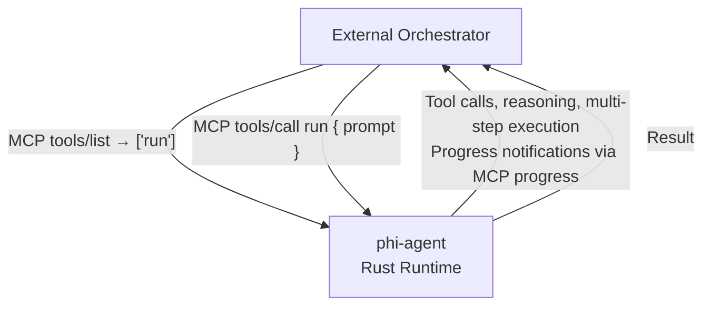

# MCP (Model Context Protocol)

phi-agent supports MCP in two roles: as a **client** (connecting to external MCP servers) and as a **server** (exposing the agent itself to external orchestrators).

## MCP Client

Connect phi-agent to external MCP servers to extend the agent's capabilities.

### Configuration

```rust
use phi_agent::McpServeConfig;

let config = McpServeConfig {
    name: "my-server".into(),
    transport: McpTransport::Stdio {
        command: "python".into(),
        args: vec!["-m".into(), "my_mcp_server".into()],
        env: vec![],  // Optional environment variables
    },
};
```

### Runtime attach/detach

MCP servers can be connected and disconnected at runtime without restarting the agent:

```rust
// Attach a new MCP server at runtime
agent.attach_mcp(config).await?;

// List active MCP connections
agent.list_mcp_servers();

// Detach a server by name
agent.detach_mcp("my-server").await?;
```

### Supported transports

| Transport | Description |
|-----------|-------------|
| `Stdio` | Subprocess communication via stdin/stdout |
| `Http` | HTTP-based JSON-RPC 2.0 |

## MCP Server (`phi serve`)

Expose phi-agent itself as an MCP server. External tools (like Claude Desktop, Codex, or custom orchestrators) can use the agent as a tool.

### Usage

```bash
# stdio mode (for subprocess integration)
phi serve --transport stdio

# HTTP mode (for network access)
phi serve --transport http --port 8080
```

### Protocol

The server exposes a single `run` tool:



This design follows the same pattern as Claude Code's `claude_code()` function and Codex — expose the agent, not individual tools.

### Event streaming

Runtime events are bridged to MCP progress notifications in real-time:

| RuntimeEvent | MCP Progress |
|-------------|-------------|
| `Thought { text }` | "Thinking: {text}" |
| `ToolCallStart { name }` | "Calling {name}..." |
| `ToolCallResult { summary }` | "{name} completed" |
| `Text { text }` | "{text}" |
| `RunCompleted` | Final result |

External orchestrators can observe the agent's reasoning and tool calls in real-time.

## Feature gate

MCP is opt-in:

```toml
[dependencies]
phi-agent = { version = "0.9", features = ["mcp"] }
```
