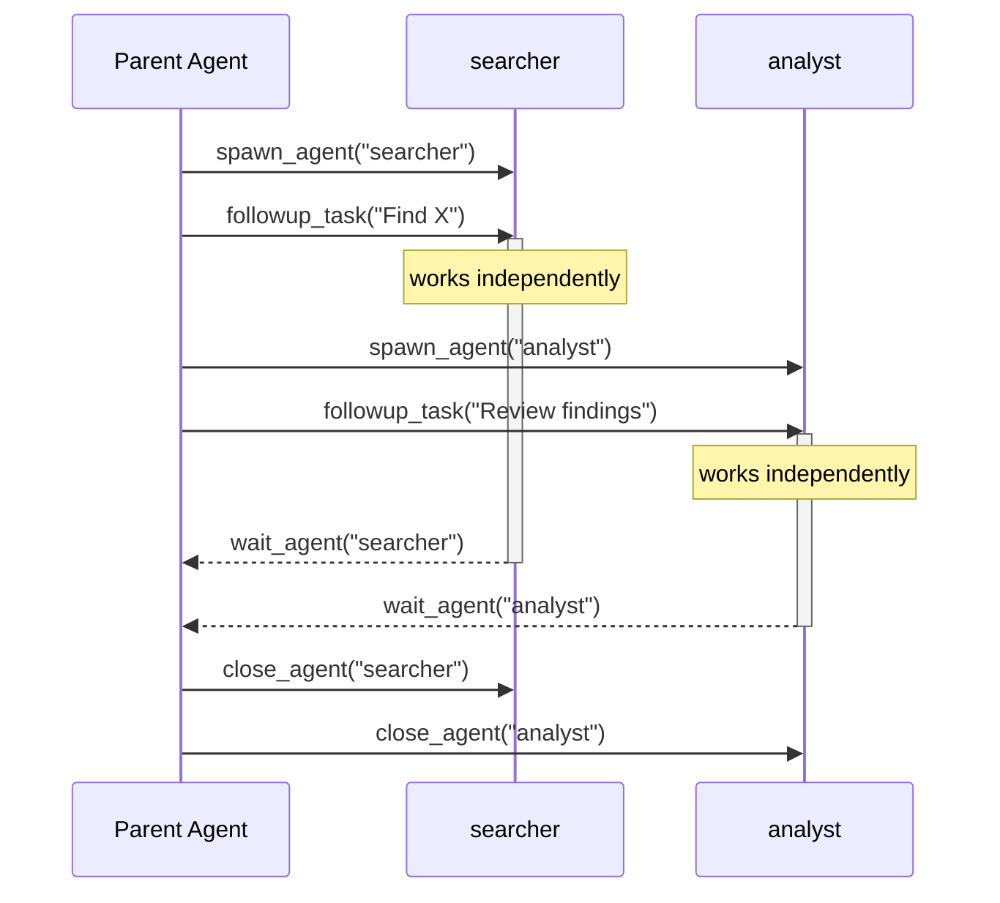

# Multi-Agent

phi-agent supports spawning sub-agents for parallel task execution. This is opt-in behind the `multi-agent` feature flag.

## Overview

Multi-agent allows the main agent to spawn child agents that work independently on sub-tasks. Each sub-agent:

- Has its own system prompt and tool set
- Runs concurrently with the parent and siblings
- Communicates via messages (not shared state)
- Is tracked by name/path for observability

**Enabling multi-agent doesn't mean the agent spawns sub-agents indiscriminately.** The agent decides based on task complexity: simple questions get direct answers, while tasks with independent dimensions (e.g., searching and reviewing simultaneously) may trigger parallel spawning. This is an LLM-driven decision based on the 6 tool definitions — not a hardcoded rule.

You can guide this behavior through the system prompt, for example:

- Encourage parallelism: *"Use sub-agents to search multiple independent sources in parallel"*
- Restrict usage: *"Don't use multi-agent for analysis tasks — handle them directly"*
- Define roles: *"Delegate research tasks to searcher, synthesis tasks to analyst"*

## Enabling

```toml
[dependencies]
phi-agent = { version = "0.9", features = ["multi-agent"] }
```

Or at runtime:

```bash
cargo run --features multi-agent
```

## Tools

When `multi-agent` is enabled, 6 tools are registered:

| Tool | Description |
|------|-------------|
| `spawn_agent` | Create a sub-agent with a name and system prompt |
| `send_message` | Send a message without triggering execution |
| `followup_task` | Send a task that triggers immediate execution |
| `wait_agent` | Block until a sub-agent sends a message |
| `list_agents` | List all active sub-agents |
| `close_agent` | Terminate a sub-agent |

## Agent lifecycle



## Configuration

```rust
use agent_works::multi_agent::MultiAgentConfig;

let config = MultiAgentConfig {
    max_agents: 10,        // Max concurrent sub-agents
    max_depth: 3,          // Max spawn nesting depth
    agent_timeout_secs: 300, // Sub-agent idle timeout
    ..Default::default()
};

let builder = base_agent_builder(llm_client)
    .with_multi_agent(config);
```

## Disabling

Multi-agent tools can be removed even when the feature is enabled:

```rust
let builder = base_agent_builder(llm_client)
    .without_multi_agent();  // Remove multi-agent tools
```

## What multi-agent is NOT

- **Not a workflow engine** — no DAG execution, no conditional branching graph. The agent decides when to spawn and what to delegate.
- **Not LangGraph** — no graph compiler, no checkpointing. Sub-agents are managed by the parent agent at runtime.
- **Not preset topologies** — no "manager/worker" or "supervisor" pattern hardcoded. You define the structure through the system prompt.

For complex workflow orchestration, combine phi-agent with LangGraph or Temporal at the application layer.
