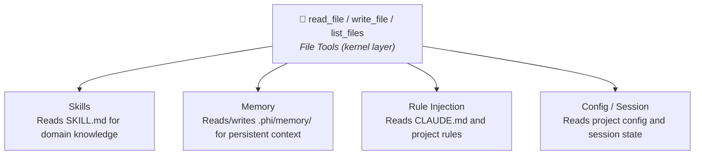

# Kernel Tools

> ⚠️ **Kernel tools are off by default.** Enable them explicitly via feature flags.

phi-agent provides three categories of kernel primitives, all opt-in and unregistered by default:

| Category | Feature | Tools | Description |
|----------|---------|-------|-------------|
| File | `file` | `read_file`, `write_file`, `list_files` | Filesystem read/write and directory browsing |
| Shell | `shell` | `execute_command` | Execute shell commands (CLI binary only) |
| Multi-Agent | `multi-agent` | `spawn_agent`, `send_message`, `followup_task`, `wait_agent`, `list_agents`, `close_agent` | Sub-agent spawning and orchestration |

## Enabling

Three ways to enable kernel tools:

### cargo add

```bash
cargo add phi-agent --features file,shell
```

### Cargo.toml

```toml
[dependencies]
phi-agent = { version = "0.9", features = ["file", "shell"] }
```

### Command line

```bash
cargo build --features file,shell
cargo run --features file,shell
```

Once enabled, `base_agent_builder()` automatically registers the corresponding tools:

```rust
let builder = base_agent_builder(llm_client)
    .system_prompt(build_system_prompt());
// Kernel tools registered based on enabled features
```

---

## File Tools (`file`)

Provides `read_file`, `write_file`, `list_files` — the architectural foundation for Skills and Memory.

### Design principles

**Path safety**. All paths are resolved relative to the working directory. Parent directory traversal (`..`) is rejected.

**Size limits**. `read_file` defaults to 2000 lines per call (use `offset`/`limit` for large files). `write_file` defaults to 1MB max per write.

**Explicit truncation**. When `write_file` truncates output, the result carries a `... (truncated)` marker so the agent knows the content is incomplete.

### Why file tools matter



---

## Shell Tool (`shell`)

Execute shell commands. **CLI binary only** (`required-features = ["shell", ...]`) — in library mode, consumers decide whether to register it.

```bash
# Enable shell when installing the CLI
cargo install phi-agent --features shell,mcp,telemetry,logging
```

---

## Multi-Agent (`multi-agent`)

6 sub-agent orchestration tools. See [Multi-Agent](../advanced/multi-agent.md) for details.

```toml
[dependencies]
phi-agent = { version = "0.9", features = ["multi-agent"] }
```

---

## Custom Kernel Tools

The built-in kernel tools are just a starting point. Implement your own the same way. See [Custom Tools](custom-tool.md).
