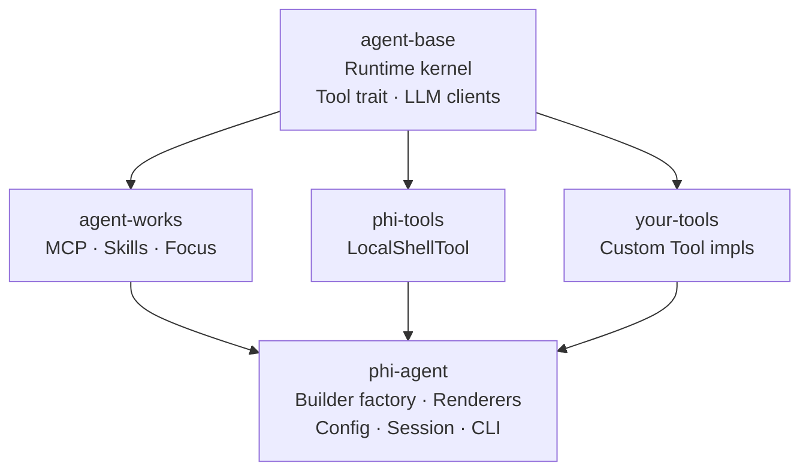

---
hide:
  - toc
  - navigation
---

<h1>
  
  phi-agent
</h1>

General-purpose Rust AI Agent Framework — simple, pure, predictable. Ship your AI apps faster.

<a href="guide/getting-started/" class="md-button md-button--primary" style="margin-right: 0.5rem">
  :octicons-arrow-right-24: &nbsp; Get Started
</a>
<a href="https://github.com/hibuka-labs/phi-agent" class="md-button" target="_blank">
  :octicons-mark-github-16: &nbsp; View on GitHub
</a>

---

-   :material-rocket-launch-outline:{ .lg .middle } **Native Performance**

    ---

    Built on Rust, zero VM overhead. Instant response, ultra-low latency under high concurrency — your agent is always online, blazing fast.

-   :material-lightbulb-on-outline:{ .lg .middle } **Easy to Use**

    ---

    A tool is just 3 methods: `name()`, `definition()`, `call()` — no hidden agents, no magic, transparent logic, fully under your control.

-   :material-puzzle-outline:{ .lg .middle } **You're in Control**

    ---

    Zero built-in tools, register on demand, freely integrate any LLM with no vendor lock-in — tools and flows are entirely in your hands.

-   :material-chart-line:{ .lg .middle } **Fully Observable**

    ---

    Every run logged, every decision traced, built-in JSONL logging, session metrics, and structured tracing — know exactly what your agent did and why, backed by rigorous test coverage you can trust.

---

## Architecture

Each crate is a separate repository under [hibuka-labs](https://github.com/hibuka-labs). All built on Rust's async runtime with `Arc<dyn LlmClient>` for provider abstraction.

## Links

-   [:octicons-mark-github-16: GitHub](https://github.com/hibuka-labs/phi-agent)

    Source code, issues, discussions.

-   [:simple-rust: crates.io](https://crates.io/crates/phi-agent)

    Add with `cargo add phi-agent`.

-   [:material-bookshelf: API Docs](https://docs.rs/phi-agent)

    Full Rustdoc on docs.rs.

---

:material-email-outline: **Contact** &nbsp; [phiagent@hibuka.com](mailto:phiagent@hibuka.com)
