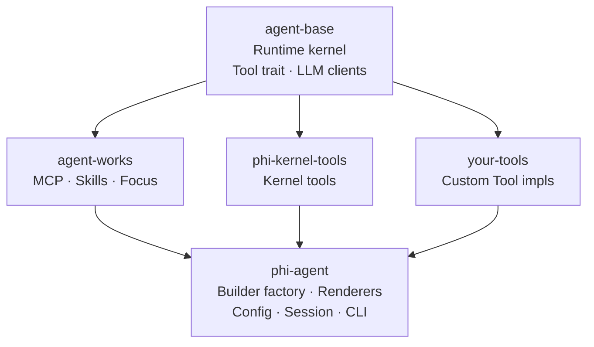

---
hide:
  - toc
  - navigation
---

<h1>
  
  phi-agent
</h1>

Rust AI Agent framework. Agent loop, session management, streaming — handled. You write three things: your tools, your prompts, your domain knowledge.

<a href="guide/getting-started/" class="md-button md-button--primary" style="margin-right: 0.5rem">
  :octicons-arrow-right-24: &nbsp; Get Started
</a>
<a href="https://github.com/hibuka-labs/phi-agent" class="md-button" target="_blank">
  :octicons-mark-github-16: &nbsp; View on GitHub
</a>

---

-   :material-target:{ .lg .middle } **Your domain, your rules**

    ---

    Agent scheduling, session management, streaming events, tool routing, approval hooks — the framework handles it. No glue code. No state management boilerplate. Focus on your domain logic.

-   :material-rocket-launch-outline:{ .lg .middle } **Single binary, zero deps**

    ---

    No Node.js. No Python. Compile to a single binary, drop it in, run it. `cargo install` gets you going in seconds.

-   :material-chart-line:{ .lg .middle } **Every step auditable**

    ---

    Every LLM call, every tool execution — logged to JSONL. Snapshottable sessions, traceable behavior, locatable issues.

---

## Architecture

Each crate is a separate repository under [hibuka-labs](https://github.com/hibuka-labs). All built on Rust's async runtime with `Arc<dyn LlmClient>` for provider abstraction. File tools and MCP are on by default; shell and multi-agent are opt-in — see [Kernel Tools](guide/tools/file-tools/) for details.

## Links

-   [:octicons-mark-github-16: GitHub](https://github.com/hibuka-labs/phi-agent)

    Source code, issues, discussions.

-   [:simple-rust: crates.io](https://crates.io/crates/phi-agent)

    Add with `cargo add phi-agent`.

-   [:material-bookshelf: API Docs](https://docs.rs/phi-agent)

    Full Rustdoc on docs.rs.

---

:material-email-outline: **Contact** &nbsp; [phiagent@hibuka.com](mailto:phiagent@hibuka.com)
