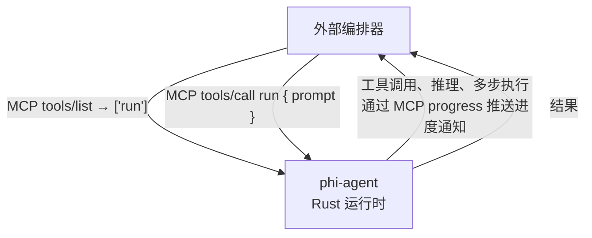

# MCP (Model Context Protocol)

phi-agent 支持两种 MCP 角色：作为**客户端**（连接外部 MCP 服务器）和作为**服务器**（将 Agent 自身暴露给外部编排器）。

## MCP 客户端

将 phi-agent 连接到外部 MCP 服务器以扩展 Agent 能力。

### 配置

```rust
use phi_agent::McpServeConfig;

let config = McpServeConfig {
    name: "my-server".into(),
    transport: McpTransport::Stdio {
        command: "python".into(),
        args: vec!["-m".into(), "my_mcp_server".into()],
        env: vec![],  // 可选的环境变量
    },
};
```

### 运行时连接/断开

MCP 服务器可在运行时动态连接和断开，无需重启 Agent：

```rust
// 运行时接入新的 MCP 服务器
agent.attach_mcp(config).await?;

// 列出活跃的 MCP 连接
agent.list_mcp_servers();

// 按名称断开
agent.detach_mcp("my-server").await?;
```

### 支持的传输方式

| 传输 | 说明 |
|------|------|
| `Stdio` | 通过 stdin/stdout 的子进程通信 |
| `Http` | 基于 HTTP 的 JSON-RPC 2.0 |

## MCP Server (`phi serve`)

将 phi-agent 自身暴露为 MCP 服务器。外部工具（如 Claude Desktop、Codex 或自定义编排器）可将 Agent 作为工具使用。

### 用法

```bash
# stdio 模式（子进程集成）
phi serve --transport stdio

# HTTP 模式（网络访问）
phi serve --transport http --port 8080
```

### 协议

服务器暴露单个 `run` 工具：



此设计遵循与 Claude Code 的 `claude_code()` 函数和 Codex 相同的模式 — 暴露 Agent，而非暴露工具列表。

### 事件流

运行时事件实时桥接为 MCP progress 通知：

| RuntimeEvent | MCP Progress |
|-------------|-------------|
| `Thought { text }` | "正在思考：{text}" |
| `ToolCallStart { name }` | "正在调用 {name}..." |
| `ToolCallResult { summary }` | "{name} 完成" |
| `Text { text }` | "{text}" |
| `RunCompleted` | 最终结果 |

外部编排器可实时观察 Agent 的推理过程和工具调用。

## Feature Gate

MCP 默认开启，显式声明可选：

```toml
[dependencies]
phi-agent = { version = "0.9", features = ["mcp"] }
```
