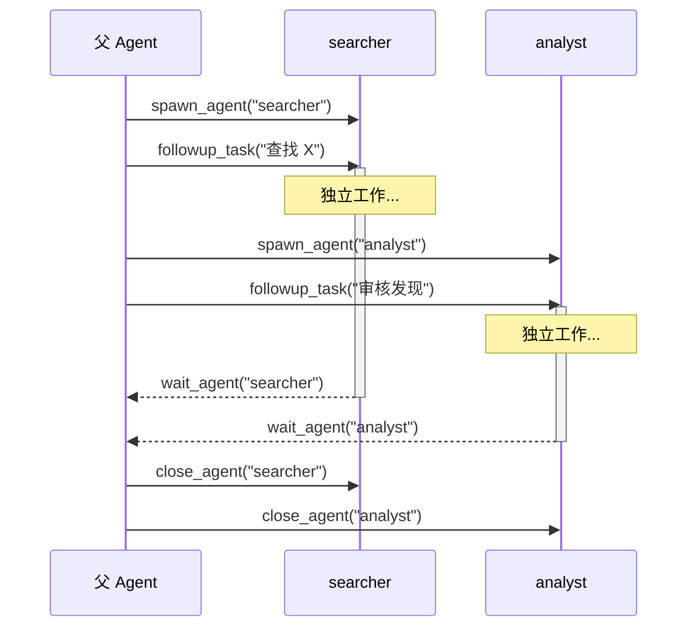

# 多 Agent

phi-agent 支持生成子 Agent 进行并行任务执行。此功能由 `multi-agent` feature flag 控制，需主动开启。

## 概述

多 Agent 允许主 Agent 生成子 Agent，每个子 Agent 独立拥有自己的 system prompt 和工具集
- 与父 Agent 及兄弟 Agent 并发运行
- 通过消息（而非共享状态）通信
- 按名称/路径追踪，便于观测

**启用后，Agent 不会无条件生成子 Agent。** 它会根据任务复杂度自行判断：简单问题直接回答，只有涉及多个独立维度（如同时搜索和审核）时，Agent 才选择并行生成。这是 LLM 基于 6 个工具定义做出的自主决策，不是硬编码的规则。

你可以通过 system prompt 引导这一行为，例如：

- 鼓励并行：*"对于涉及多个独立信息源的问题，使用子 Agent 并行搜索"*
- 限制使用：*"分析类任务不要用多 Agent，直接处理即可"*
- 定义角色：*"将研究类任务委派给 searcher，综合类任务委派给 analyst"*

## 启用方式

```toml
[dependencies]
phi-agent = { version = "0.9", features = ["multi-agent"] }
```

或运行时：

```bash
cargo run --features multi-agent
```

## 工具

启用 `multi-agent` 后，注册 6 个工具：

| 工具 | 说明 |
|------|------|
| `spawn_agent` | 创建子 Agent，指定名称和 system prompt |
| `send_message` | 发送消息，不触发执行 |
| `followup_task` | 发送任务并立即触发执行 |
| `wait_agent` | 阻塞等待子 Agent 的消息 |
| `list_agents` | 列出所有活跃的子 Agent |
| `close_agent` | 终止指定子 Agent |

## Agent 生命周期



## 配置

```rust
use agent_works::multi_agent::MultiAgentConfig;

let config = MultiAgentConfig {
    max_agents: 10,          // 最大并发子 Agent 数
    max_depth: 3,            // 最大嵌套深度
    agent_timeout_secs: 300, // 子 Agent 空闲超时
    ..Default::default()
};

let builder = base_agent_builder(llm_client)
    .with_multi_agent(config);
```

## 禁用

即使 feature 已启用，也可移除多 Agent 工具：

```rust
let builder = base_agent_builder(llm_client)
    .without_multi_agent();  // 移除多 Agent 工具
```

## 多 Agent 不是什么

- **不是工作流引擎** — 没有 DAG 执行、条件分支图。Agent 自行决定何时生成、委托什么。
- **不是 LangGraph** — 没有图编译器、检查点。子 Agent 由父 Agent 在运行时管理。
- **不是预设拓扑** — 不硬编码"管理者/工作者"或"监督者"模式。你通过 system prompt 定义结构。

需要复杂的工作流编排时，在应用层将 phi-agent 与 LangGraph 或 Temporal 结合使用。
