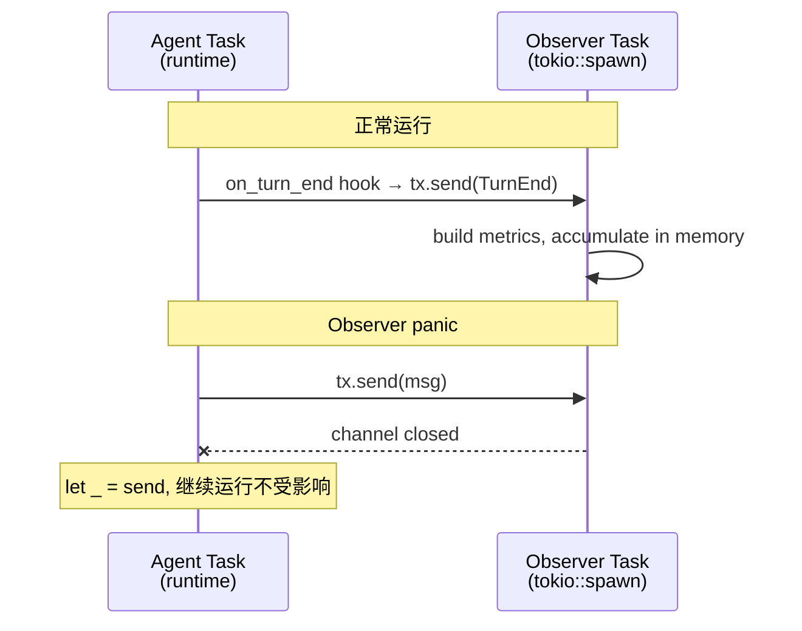

# 可观测性

phi-agent 自动采集结构化指标，无需额外配置 — 每个 session 都会在现有会话数据旁边写入 `session_metrics.json`。

## 采集内容

### 每轮指标 (`TurnMetrics`)

| 字段 | 说明 |
|-------|-------------|
| `turn_number` | 当前第几轮 |
| `duration_ms` | 本轮总耗时 |
| `time_to_first_token_ms` | 用户等待第一个 token 的时间（核心体验指标） |
| `llm_duration_ms` | LLM 纯耗时 |
| `tool_duration_ms` | 工具执行耗时 |
| `input_tokens` / `output_tokens` | LLM 返回的 token 用量 |
| `tool_call_count` / `tools_used` | 调用了哪些工具、多少次 |
| `tool_success` / `tool_failed` | 工具成功/失败次数 |
| `outcome` | `completed` / `tool_calls` / `error` / `cancelled` / `max_turns` |
| `has_thinking` | 模型是否使用了深度思考 |
| `user_input` | 截断至 80 字 |

### 会话汇总 (`SessionMetrics`)

| 字段 | 说明 |
|-------|-------------|
| `total_turns` | 会话总轮数 |
| `total_input_tokens` / `total_output_tokens` | 累计 token |
| `estimated_cost` | 基于模型定价的费用估算 |
| `tool_breakdown` | 每种工具的调用次数（如 `{"shell": 5, "check_quality": 2}`） |
| `tool_fail_rate` | 工具调用失败比例 |
| `p50_turn_ms` / `p95_turn_ms` / `p99_turn_ms` | 延迟百分位 |
| `outcome` | `completed` / `failed` / `cancelled` / `max_turns` |
| `error_count` | 出错的轮数 |

## CLI 命令

```bash
# 列出本机所有会话
phi metrics list
# 输出:
#   Session                        Turns   Tokens    Cost   Outcome
#   20260729_abc12345 (phi-bard)    5      27,000   $0.18  ✅ completed
#   20260729_def67890 (phi)         3      11,000   $0.06  ✅ completed

# 查看指定会话详情
phi metrics show 20260729_abc12345

# 查看最近一个会话
phi metrics last
```

## 环境变量

| 变量 | 默认值 | 说明 |
|----------|---------|-------------|
| `PHI_METRICS_ENABLED` | `true` | 设为 `false` 完全禁用指标采集（适合资源受限设备） |
| `PHI_NODE_ID` | `""` | 节点标识，区分是哪台机器产生的指标 |
| `PHI_COST_PER_1K_TOKENS` | 内置 | 自定义模型定价。格式：`输入费用,输出费用` 每千 token（如 `0.002,0.008`）。不设则使用内置的 Claude/GPT 定价表。 |

## 业务自定义指标

`custom` 字段允许注入任意 JSON 数据，框架不感知内容：

```rust
use phi_telemetry::{init_telemetry, save_metrics};

// 初始化观测并注入 session 级别的业务数据
let mut handle = init_telemetry(agent.runtime(), session_id, node_id, model);
handle.set_session_custom(serde_json::json!({
    "product": "my-app",
    "version": "1.0"
}));

// ... agent 运行 ...

// 关闭并保存
handle.shutdown().await;
let session = handle.session.read().await;
let mut session = session.clone();
session.finalize(SessionOutcome::Completed);
save_metrics(&session, &session_dir)?;
```

最终 `session_metrics.json` 中：

```json
{
  "session_id": "...",
  "total_turns": 3,
  "custom": {
    "product": "my-app",
    "version": "1.0"
  }
}
```

## 架构

观测代码运行在**独立的 tokio task** 中，通过 mpsc channel 与 agent 通信：



- Observer panic **永远不会影响 agent** — hook 静默丢弃失败的发送
- 会话期间 metrics 在内存中累积，`save_metrics()` 在 `shutdown()` 后写入磁盘
- Channel 是 unbounded 的 — 绝不阻塞 agent 热路径

## 文件布局

```
~/.phi-agent/sessions/<session_id>/
├── turn_001.jsonl          ← 完整事件流（对话、思考、工具参数/结果）
├── turn_002.jsonl
├── session_meta.json       ← 会话元信息
├── session.log             ← tracing 日志
└── session_metrics.json    ← 结构化指标（几 KB）
```

## 禁用

```bash
# 全局禁用
export PHI_METRICS_ENABLED=false

# 或单次禁用
PHI_METRICS_ENABLED=false phi "你好"
```
