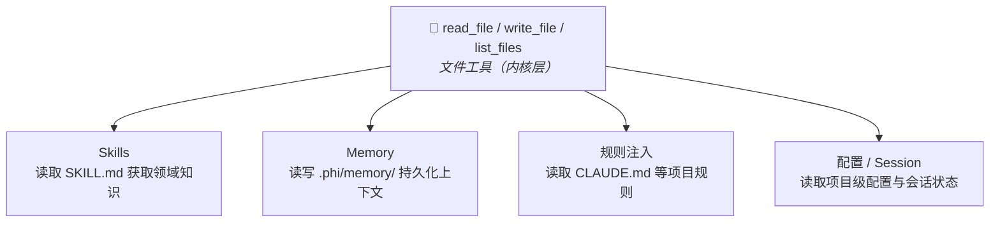

# 内核工具

> ⚠️ **内核工具默认关闭。** 需通过 feature flag 显式启用。

phi-agent 提供三类内核原语，全部 opt-in，默认不注册：

| 类别 | Feature | 工具 | 说明 |
|------|---------|------|------|
| 文件 | `file` | `read_file`、`write_file`、`list_files` | 文件系统读写与目录浏览 |
| Shell | `shell` | `execute_command` | 执行 Shell 命令（仅 CLI 二进制） |
| 多 Agent | `multi-agent` | `spawn_agent`、`send_message`、`followup_task`、`wait_agent`、`list_agents`、`close_agent` | 子 Agent 调度与通信 |

## 启用方式

三种方式任选：

### cargo add

```bash
cargo add phi-agent --features file,shell
```

### Cargo.toml

```toml
[dependencies]
phi-agent = { version = "0.9", features = ["file", "shell"] }
```

### 命令行编译

```bash
cargo build --features file,shell
cargo run --features file,shell
```

启用后，`base_agent_builder()` 自动注册对应的工具：

```rust
let builder = base_agent_builder(llm_client)
    .system_prompt(build_system_prompt());
// 根据启用的 feature，自动注册内核工具
```

---

## 文件工具 (`file`)

提供 `read_file`、`write_file`、`list_files` 三个工具，是 Skills 和 Memory 的架构基座。

### 设计原则

**路径安全**。所有路径相对工作目录解析，拒绝父目录穿越（`..`）。

**大小限制**。`read_file` 默认每次最多 2000 行（大文件用 `offset`/`limit` 分页）。`write_file` 默认单次最多 1MB。

**显式截断**。当 `write_file` 输出被截断时，结果会携带 `... (truncated)` 标记，Agent 可据此判断内容不完整。

### 为什么文件工具很重要



---

## Shell 工具 (`shell`)

执行 Shell 命令。**仅 CLI 二进制可用**（`required-features = ["shell", ...]`），库模式下由消费者自行决定是否注册。

```bash
# CLI 安装时启用 shell
cargo install phi-agent --features shell,mcp,telemetry,logging
```

---

## 多 Agent (`multi-agent`)

6 个子 Agent 调度工具，详见[多 Agent](../advanced/multi-agent.md)。

```toml
[dependencies]
phi-agent = { version = "0.9", features = ["multi-agent"] }
```

---

## 自定义内核工具

内置的内核工具只是一个起点，用同样的方式定制实现你自己的内核工具。详见[自定义工具](custom-tool.md)。
