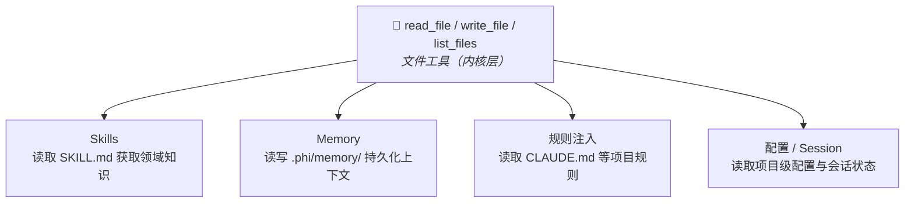

# 文件工具

phi-agent 通过内核工具为 Agent 提供文件系统的读写/列表访问能力。默认开启（由 `file` feature flag 控制）。

## 可用工具

| 工具 | 说明 |
|------|------|
| `read_file` | 读取文件，支持 offset/limit 分页读取大文件 |
| `write_file` | 创建或覆写文件 |
| `list_files` | 列出目录内容，支持 glob 模式 |

## 设计原则

**路径安全**。所有路径相对工作目录解析，拒绝父目录穿越（`..`）。

**大小限制**。`read_file` 默认每次最多 2000 行（大文件用 `offset`/`limit` 分页）。`write_file` 默认单次最多 1MB。

**显式截断**。当 `write_file` 输出被截断时，结果会携带 `... (truncated)` 标记，Agent 可据此判断内容不完整。

## 使用方式

文件工具由 `base_agent_builder()` 自动注册，无需额外配置：

```rust
let builder = base_agent_builder(llm_client)
    .system_prompt(build_system_prompt());
// read_file, write_file, list_files 已自动注册
```

禁用文件工具：

```toml
# Cargo.toml
[dependencies]
phi-agent = { version = "0.9", default-features = false, features = ["shell"] }
```

## 为什么文件工具很重要

文件工具是 Skills 和 Memory 的架构基座：一组通用文件操作替代多个专用工具，Agent 直接读写文件系统，框架退居 OS 角色。



这与 Claude Code 和 Codex 的模式一致：Agent 通过标准文件操作与项目交互，不需要为每种资源类型定义专用工具。
