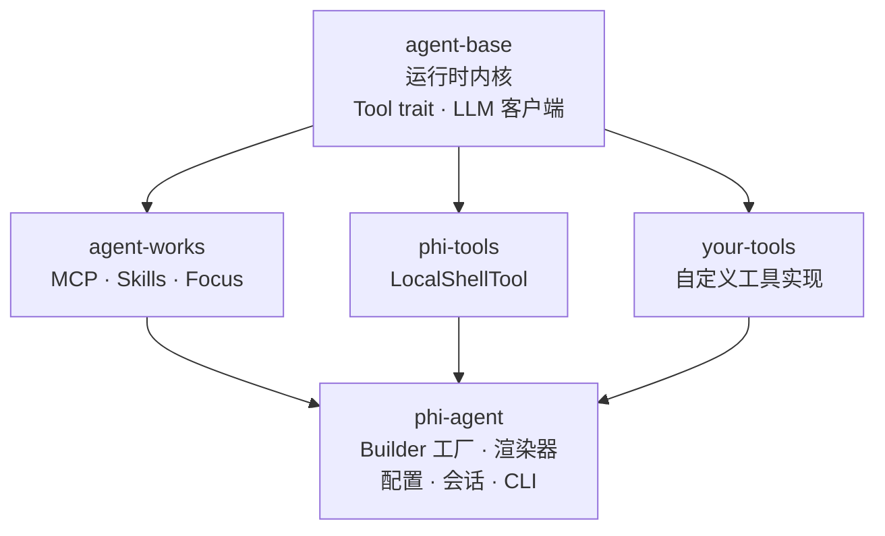

---
hide:
  - toc
  - navigation
---

<h1>
  
  phi-agent
</h1>

Rust 通用 AI Agent 框架 — 简单、纯粹、可预测。

<a href="guide/getting-started/" class="md-button md-button--primary" style="margin-right: 0.5rem">
  :octicons-arrow-right-24: &nbsp; 快速开始
</a>
<a href="https://github.com/hibuka-labs/phi-agent" class="md-button" target="_blank">
  :octicons-mark-github-16: &nbsp; GitHub
</a>

---

-   :material-rocket-launch-outline:{ .lg .middle } **极致性能**

    ---

    基于 Rust 构建，零虚拟机开销，即刻响应，高并发下保持极低延迟——Agent 始终在线，极速响应。

-   :material-lightbulb-on-outline:{ .lg .middle } **简单易用**

    ---

    一个工具只需 3 个方法：`name()`、`definition()`、`call()`——没有隐藏 Agent，没有黑魔法，逻辑透明，尽在掌握。

-   :material-puzzle-outline:{ .lg .middle } **你说了算**

    ---

    零内置工具，按需注册，LLM 自由接入，拒绝厂商锁定——工具与流程，皆由你掌控。

-   :material-chart-line:{ .lg .middle } **全程可观测**

    ---

    每次运行有日志，每次决策可追溯，内置 JSONL 日志、会话指标、结构化追踪——行为与动机一目了然，高覆盖测试兜底，每次运行都值得信赖。

---

## 架构

每个 crate 都是 [hibuka-labs](https://github.com/hibuka-labs) 下的独立仓库。基于 Rust 异步运行时，通过 `Arc<dyn LlmClient>` 实现 LLM 提供商抽象。

## 链接

-   [:octicons-mark-github-16: GitHub](https://github.com/hibuka-labs/phi-agent)

    源码、Issues、讨论。

-   [:simple-rust: crates.io](https://crates.io/crates/phi-agent)

    `cargo add phi-agent` 即可引入。

-   [:material-bookshelf: API 文档](https://docs.rs/phi-agent)

    完整的 Rustdoc 文档。

---

:material-email-outline: **联系** &nbsp; [phiagent@hibuka.com](mailto:phiagent@hibuka.com)
