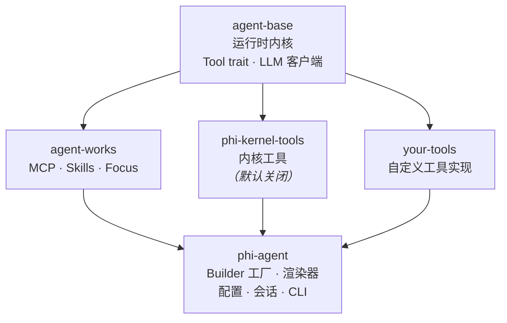

---
hide:
  - toc
  - navigation
---

<h1>
  
  phi-agent
</h1>

不是又一个 AI Agent，而是构建 Agent 应用的开放基座 — 专为嵌入式、边缘及垂直行业打造，同样适合高定制、高性能的云端和桌面 AI 应用，简单、纯粹、可控。

<a href="guide/getting-started/" class="md-button md-button--primary" style="margin-right: 0.5rem">
  :octicons-arrow-right-24: &nbsp; 快速开始
</a>
<a href="https://github.com/hibuka-labs/phi-agent" class="md-button" target="_blank">
  :octicons-mark-github-16: &nbsp; GitHub
</a>

---

-   :material-target:{ .lg .middle } **你的领域，你做主**

    ---

    不是通用 Chatbot，而是面向定制场景的开放基座。不预设任何业务，不绑定任何工具，不替你做领域内的决定。一切交给你——能力由你定义，规则由你书写。

-   :material-rocket-launch-outline:{ .lg .middle } **极致轻量，哪里都能跑**

    ---

    Rust 单二进制，无运行时依赖，从嵌入式 Linux、边缘网关到云端容器、桌面应用，`cargo install` 即用，随地部署。

-   :material-puzzle-outline:{ .lg .middle } **接口纯粹，上手易用**

    ---

    工具定义只需 <code>name()</code> · <code>definition()</code> · <code>call()</code> —— 三个方法，三个原语，构成 Agent 能力的全部表达。不发明新语法，不引入新概念，用最纯粹的代码完成最完整的能力定义。

-   :material-chart-line:{ .lg .middle } **全程可观测，每一步可解释**

    ---

    每次决策有记录，每个步骤可追踪，内置会话日志与结构化追踪，会话指标一目了然，垂直场景合规审计无压力。

---

## 架构

每个 crate 都是 [hibuka-labs](https://github.com/hibuka-labs) 下的独立仓库。基于 Rust 异步运行时，通过 `Arc<dyn LlmClient>` 实现 LLM 提供商抽象。`phi-kernel-tools`（内核工具）**默认关闭** — 详见[内核工具](guide/tools/file-tools/)了解如何启用。

## 链接

-   [:octicons-mark-github-16: GitHub](https://github.com/hibuka-labs/phi-agent)

    源码、Issues、讨论。

-   [:simple-rust: crates.io](https://crates.io/crates/phi-agent)

    `cargo add phi-agent` 即可引入。

-   [:material-bookshelf: API 文档](https://docs.rs/phi-agent)

    完整的 Rustdoc 文档。

---

:material-email-outline: **联系** &nbsp; [phiagent@hibuka.com](mailto:phiagent@hibuka.com)
