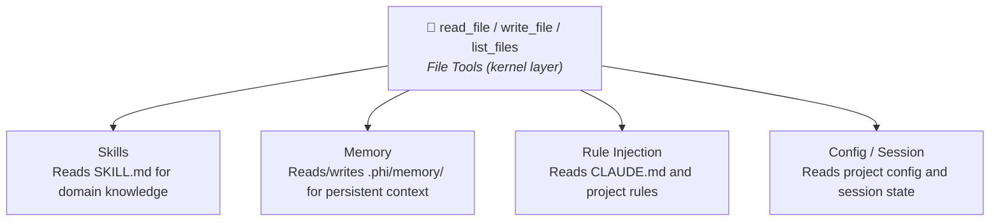

# File Tools

phi-agent gives the agent read/write/list access to the filesystem through kernel tools. These are opt-in — enable via the `file` feature flag.

## Available tools

| Tool | Description |
|------|-------------|
| `read_file` | Read a file, with optional offset/limit for paging large files |
| `write_file` | Create or overwrite a file |
| `list_files` | List directory contents, supports glob patterns |

## Design principles

**Path safety**. All paths are resolved relative to the working directory. Parent directory traversal (`..`) is rejected.

**Size limits**. `read_file` defaults to 2000 lines per call (use `offset`/`limit` for large files). `write_file` defaults to 1MB max per write.

**Explicit truncation**. When `write_file` truncates output, the result carries a `... (truncated)` marker so the agent knows the content is incomplete.

## Usage

The file tools are registered automatically by `base_agent_builder()` when the `file` feature is enabled. To use them, enable the feature in your `Cargo.toml`:

```toml
[dependencies]
phi-agent = { version = "0.9", features = ["file"] }
```

```rust
let builder = base_agent_builder(llm_client)
    .system_prompt(build_system_prompt());
// read_file, write_file, list_files are registered
```

To disable file tools:

```toml
# Cargo.toml
[dependencies]
phi-agent = { version = "0.9", default-features = false, features = ["shell"] }
```

## Why file tools matter

File tools are the architectural foundation for Skills and Memory: one set of generic file operations replaces multiple dedicated tools. The agent reads and writes the filesystem directly — the framework is the OS.



This is the same pattern used by Claude Code and Codex: the agent interacts with the project through standard file operations — no dedicated tools for each resource type.
